# 🎓 Sistema de Matrícula VB.NET


**Sistema de Matrícula VB.NET** es una aplicación de escritorio desarrollada en **Visual Basic .NET** con **Windows Forms**, orientada a la gestión de un sistema académico de matrícula.

El proyecto permite administrar información relacionada con **asignaturas**, **docentes**, **estudiantes**, **sedes**, **grupos**, **subgrupos** y **horarios**, utilizando una estructura organizada por capas y conexión con base de datos.

<p align="center">
  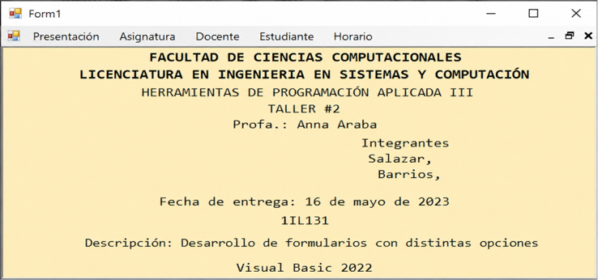
</p>

---

## 📌 Tabla de contenido

- [Descripción](#-descripción)
- [Capturas del proyecto](#-capturas-del-proyecto)
- [Características principales](#-características-principales)
- [Tecnologías utilizadas](#-tecnologías-utilizadas)
- [Arquitectura del proyecto](#-arquitectura-del-proyecto)
- [Módulos del sistema](#-módulos-del-sistema)
- [Base de datos](#-base-de-datos)
- [Funcionamiento general](#-funcionamiento-general)
- [Estructura del repositorio](#-estructura-del-repositorio)
- [Cómo abrir el proyecto](#-cómo-abrir-el-proyecto)
- [Documentación](#-documentación)
- [Conceptos aplicados](#-conceptos-aplicados)
- [Mejoras futuras](#-mejoras-futuras)
- [Autor](#-autor)
- [Estado del proyecto](#-estado-del-proyecto)

---

## 📖 Descripción

Este proyecto consiste en un sistema de matrícula académico desarrollado como aplicación de escritorio.

El objetivo principal es facilitar el proceso de matrícula de un centro educativo mediante una interfaz gráfica que permita registrar, consultar, editar y eliminar información relacionada con la gestión académica.

El sistema contempla funcionalidades para:

- Inicio de sesión.
- Gestión de asignaturas.
- Gestión de docentes.
- Gestión de estudiantes.
- Consulta de horarios.
- Administración de registros.
- Visualización de datos mediante tablas.
- Conexión con base de datos.

---

## 🖼️ Capturas del proyecto

### Diagrama de casos de uso

<p align="center">
  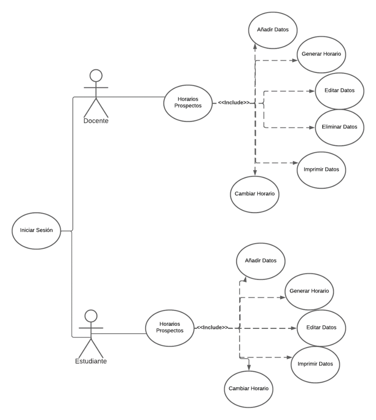
</p>

El diagrama muestra la interacción de los actores **Docente** y **Estudiante** con los módulos principales del sistema.

---

### Diagrama de base de datos

<p align="center">
  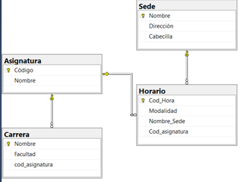
</p>

El sistema trabaja con entidades como **Sede**, **Asignatura**, **Carrera** y **Horario**, conectadas mediante relaciones de base de datos.

---

### Modelo entidad-relación

<p align="center">
  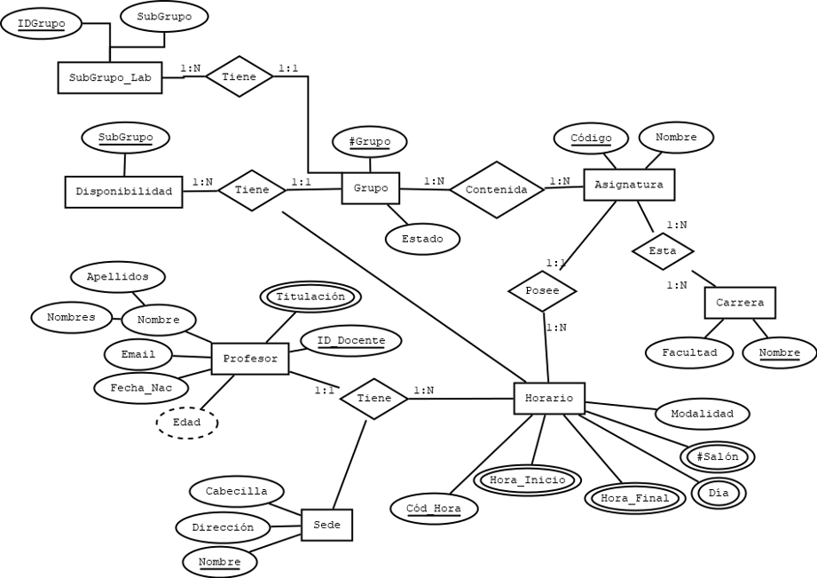
</p>

El modelo entidad-relación representa las asociaciones entre asignaturas, grupos, subgrupos, profesores, horarios, sedes y carreras.

---

### Inicio de sesión

<p align="center">
  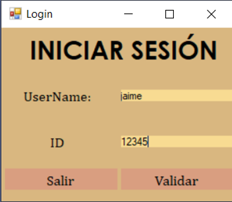
</p>

El formulario de inicio de sesión permite validar el acceso al sistema mediante un nombre de usuario y un identificador.

---

### Pantalla de presentación

<p align="center">
  
</p>

La pantalla de presentación muestra los datos generales del proyecto y sirve como punto inicial de navegación dentro del sistema.

---

### Matrícula de asignaturas

<p align="center">
  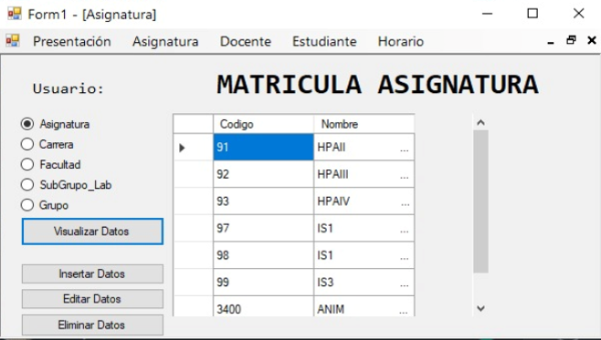
</p>

El módulo de asignatura permite visualizar datos académicos relacionados con asignaturas, carreras, facultades, subgrupos y grupos.

---

### Insertar asignatura

<p align="center">
  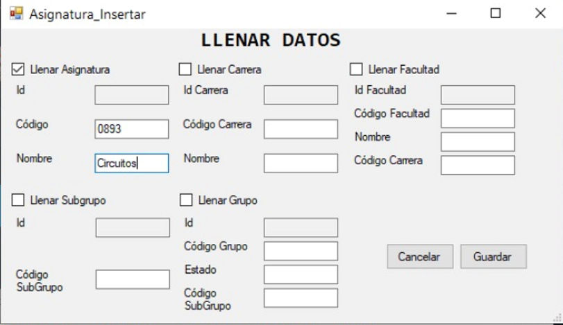
</p>

El formulario de inserción permite registrar nueva información académica en el sistema.

---

### Confirmación de eliminación

<p align="center">
  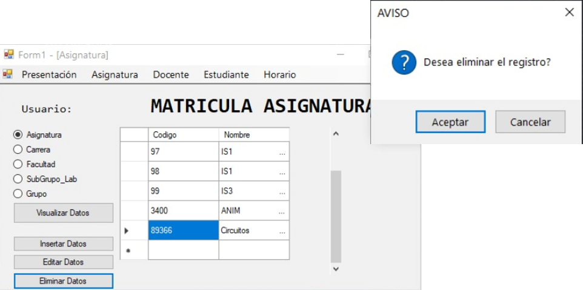
</p>

Antes de eliminar un registro, el sistema muestra un mensaje de confirmación para evitar eliminaciones accidentales.

---

### Registro guardado correctamente

<p align="center">
  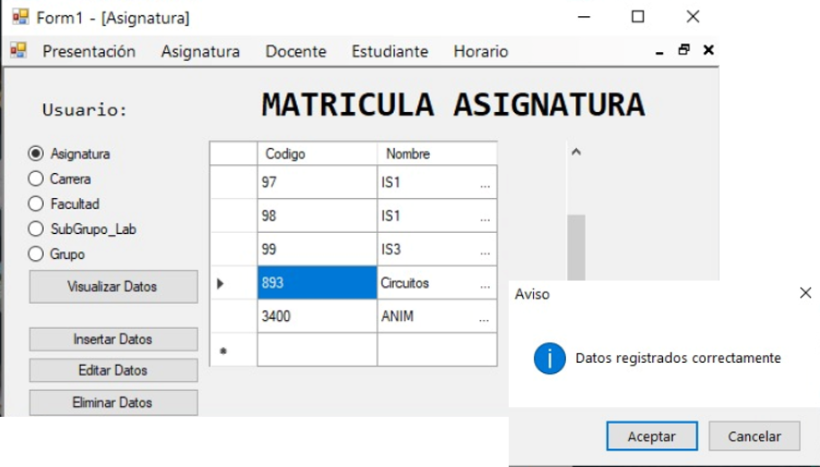
</p>

El sistema notifica cuando los datos han sido registrados correctamente.

---

### Registro eliminado correctamente

<p align="center">
  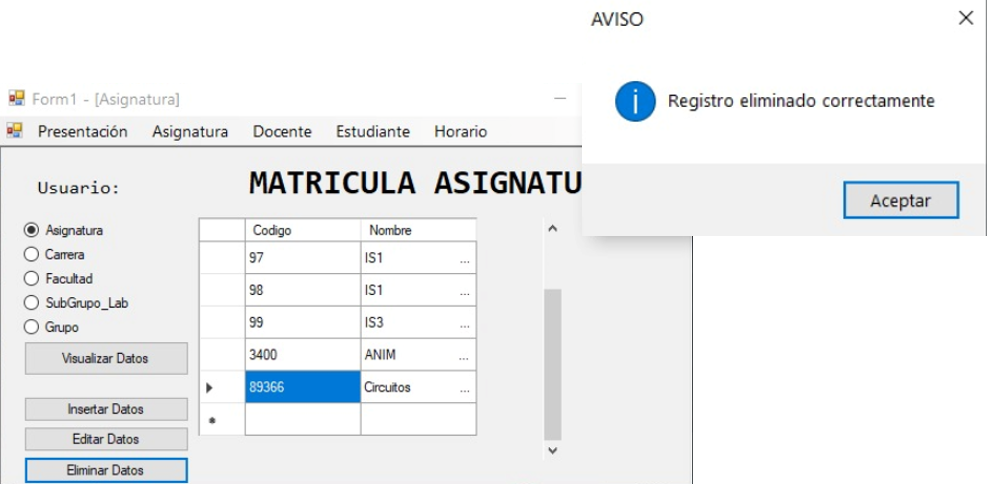
</p>

El sistema confirma cuando un registro fue eliminado correctamente.

---

### Sección de estudiantes

<p align="center">
  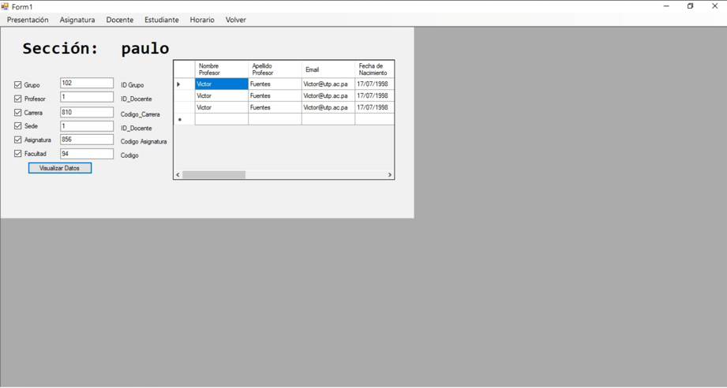
</p>

La sección de estudiantes permite consultar información administrativa y académica relacionada con los estudiantes.

---

### Datos administrativos

<p align="center">
  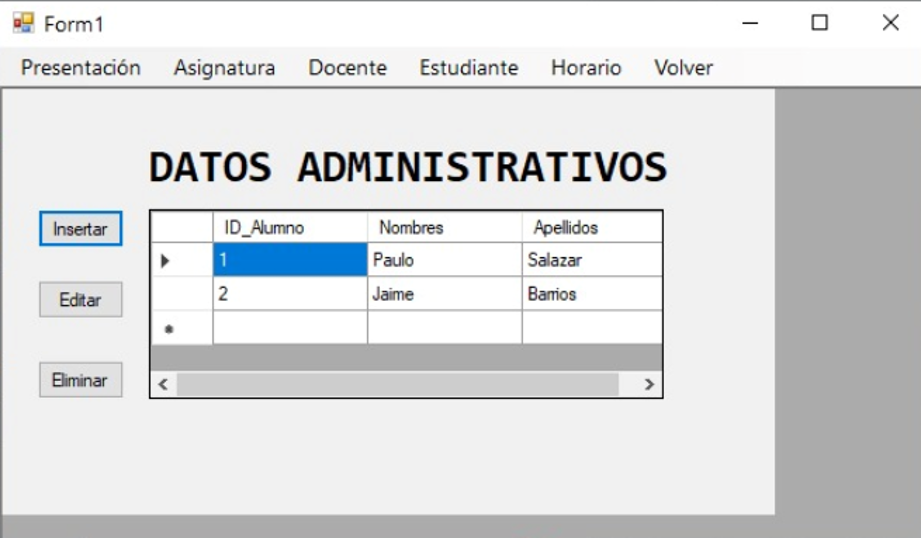
</p>

El sistema muestra registros de estudiantes en una tabla administrativa con opciones de inserción, edición y eliminación.

---

### Insertar estudiante

<p align="center">
  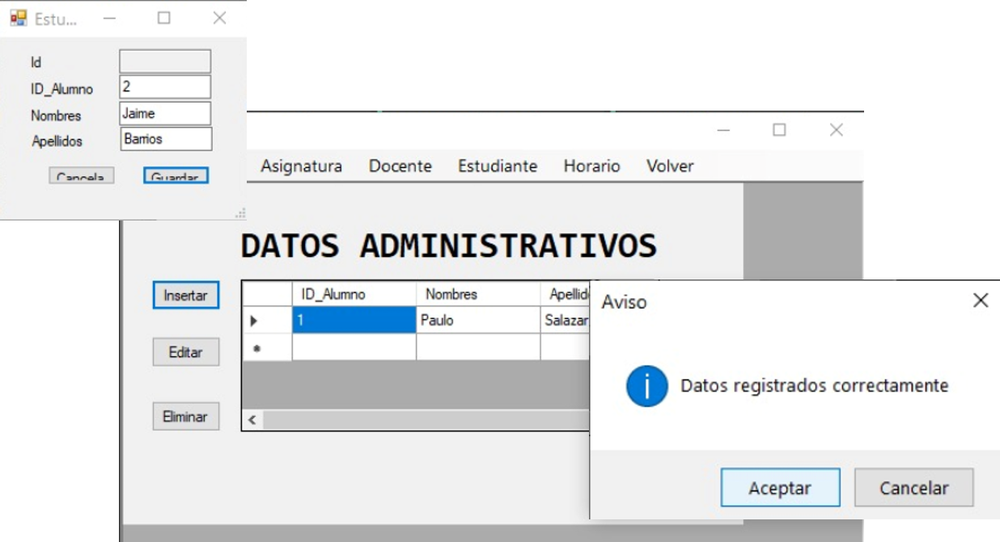
</p>

El formulario de estudiante permite registrar datos básicos como identificador, nombres y apellidos.

---

### Tabla de profesores

<p align="center">
  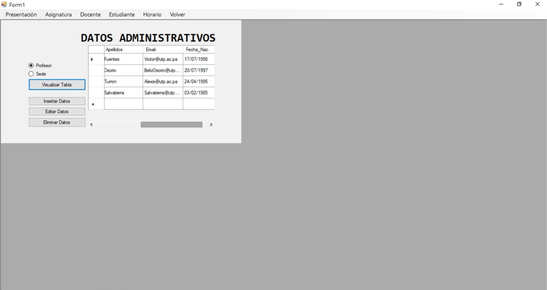
</p>

El módulo de docentes permite visualizar información de profesores y sedes registradas.

---

### Opciones de docente

<p align="center">
  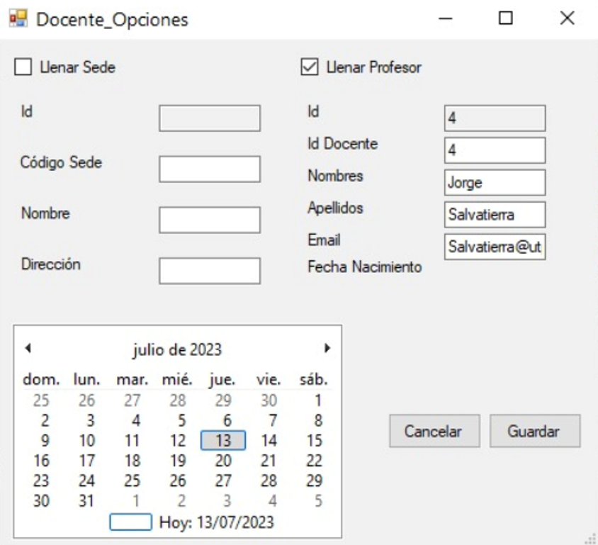
</p>

El formulario de docente permite registrar o editar información del profesor y datos asociados a la sede.

---

### Vista compacta

| Presentación | Login |
|-------------|-------|
|  |  |

| Asignaturas | Insertar datos |
|------------|----------------|
|  |  |

| Estudiantes | Docentes |
|-------------|----------|
|  |  |

---

## ✨ Características principales

- Aplicación de escritorio con **Windows Forms**.
- Desarrollada en **Visual Basic .NET**.
- Interfaz gráfica con formularios.
- Inicio de sesión.
- Gestión de asignaturas.
- Gestión de docentes.
- Gestión de estudiantes.
- Gestión de horarios.
- Visualización de registros mediante `DataGridView`.
- Operaciones de inserción, edición y eliminación.
- Confirmaciones mediante ventanas de aviso.
- Conexión con base de datos.
- Organización por capas.
- Proyecto académico orientado a la gestión de matrícula.

---

## 🛠️ Tecnologías utilizadas

- **Visual Basic .NET**
- **Windows Forms**
- **Visual Studio 2022**
- **SQL Server**
- **DataGridView**
- **Programación orientada a objetos**
- **Arquitectura por capas**
- **Base de datos relacional**

---

## 🏗️ Arquitectura del proyecto

El proyecto está organizado en tres capas principales:

| Capa | Carpeta | Descripción |
|-----|---------|-------------|
| Datos | `Dato/` | Contiene clases relacionadas con las entidades del sistema. |
| Lógica | `Logic/` | Contiene la lógica del sistema y operaciones entre datos y presentación. |
| Presentación | `Presentar/` | Contiene los formularios de Windows Forms y la interfaz visual. |

Esta estructura permite separar responsabilidades y mantener el proyecto más organizado.

---

## 🧩 Módulos del sistema

### Presentación

Contiene la pantalla inicial del sistema y el menú principal de navegación.

### Asignatura

Permite visualizar, insertar, editar y eliminar información relacionada con asignaturas, carreras, facultades, grupos y subgrupos.

### Docente

Permite administrar información de docentes y sedes.

### Estudiante

Permite registrar y consultar información de estudiantes.

### Horario

Permite visualizar información relacionada con horarios académicos.

### Login

Permite validar el acceso inicial al sistema.

---

## 🗄️ Base de datos

El sistema utiliza una base de datos relacional para almacenar la información académica.

Entidades principales:

| Entidad | Descripción |
|--------|-------------|
| `Asignatura` | Materias disponibles para matrícula. |
| `Carrera` | Carreras asociadas a asignaturas. |
| `Sede` | Sedes donde se imparten clases. |
| `Horario` | Horarios de las asignaturas. |
| `Profesor` | Información de docentes. |
| `Estudiante` | Información de estudiantes. |
| `Grupo` | Grupos disponibles. |
| `SubGrupo_Lab` | Subgrupos de laboratorio. |

---

## ⚙️ Funcionamiento general

El sistema inicia con un formulario de login.

Luego de validar el acceso, el usuario puede navegar entre las opciones del menú principal:

```text
Presentación
Asignatura
Docente
Estudiante
Horario
Volver
```

Cada módulo permite realizar operaciones específicas según el tipo de información que se desea consultar o modificar.

---

## 📁 Estructura del repositorio

```text
matricula-system-vbnet/
│
├── README.md
├── .gitignore
│
├── Dato/
│   ├── Asignatura.vb
│   ├── Carrera.vb
│   ├── Estudiante.vb
│   ├── Facultad.vb
│   ├── Grupo.vb
│   ├── Horario.vb
│   ├── Profesor.vb
│   ├── Sede.vb
│   └── SubGrupo_Lab.vb
│
├── Logic/
│   ├── Asignatura.vb
│   ├── Carrera.vb
│   ├── Estudiante.vb
│   ├── Facultad.vb
│   ├── Grupo.vb
│   ├── Horario.vb
│   ├── Profesor.vb
│   ├── Sede.vb
│   └── SubGrupo_Lab.vb
│
├── Presentar/
│   ├── Login.vb
│   ├── Presentacion.vb
│   ├── Asignatura.vb
│   ├── Asignatura_Opciones.vb
│   ├── Docente.vb
│   ├── Docente_Opciones.vb
│   ├── Estudiante.vb
│   ├── Estudiante_Opciones.vb
│   ├── Horario.vb
│   └── Presentar.vbproj
│
├── assets/
│   ├── 01-use-case-diagram.png
│   ├── 02-database-diagram.png
│   ├── 03-entity-relationship-diagram.png
│   ├── 04-login.png
│   ├── 05-presentation.png
│   ├── 06-subject-registration.png
│   ├── 07-insert-subject.png
│   ├── 08-delete-confirmation.png
│   ├── 09-register-success.png
│   ├── 10-delete-success.png
│   ├── 11-student-section.png
│   ├── 12-student-admin-data.png
│   ├── 13-insert-student.png
│   ├── 14-teacher-table.png
│   └── 15-teacher-options.png
│
└── docs/
    ├── Informe_Tecnico_Matricula_Sistema.pdf
    └── Codigos/
        ├── Asignatura.pdf
        ├── Asignatura_Opciones.pdf
        ├── Docente.pdf
        ├── Docente_Opciones.pdf
        ├── Estudiante.pdf
        ├── Estudiante_Opciones.pdf
        ├── Horario.pdf
        ├── Login.pdf
        ├── Menu.pdf
        └── Menu_User.pdf
```

---

## ▶️ Cómo abrir el proyecto

### 1. Clonar el repositorio

```bash
git clone https://github.com/SalazarPaulo/matricula-system-vbnet.git
```

### 2. Abrir en Visual Studio

Abre Visual Studio 2022 y selecciona:

```text
Open a project or solution
```

Luego abre el archivo:

```text
Presentar/Presentar.vbproj
```

### 3. Verificar referencias

El proyecto de presentación utiliza referencias a las capas:

```text
Dato/
Logic/
Presentar/
```

Por eso se debe conservar la estructura de carpetas del repositorio.

### 4. Ejecutar

Desde Visual Studio:

```text
Start / Iniciar
```

---

## 📚 Documentación

El repositorio incluye el informe técnico del proyecto dentro de la carpeta `docs/`.

```text
docs/Informe_Tecnico_Matricula_Sistema.pdf
```

La documentación incluye:

- Resumen del proyecto.
- Introducción.
- Objetivos.
- Planteamiento del problema.
- Alcance.
- Justificación.
- Diseño del sistema.
- Diagramas de casos de uso.
- Diagrama de base de datos.
- Pruebas de ejecución.
- Glosario.
- Referencias.

---

## 🧠 Conceptos aplicados

- Programación orientada a objetos.
- Desarrollo de aplicaciones de escritorio.
- Windows Forms.
- Conexión con base de datos.
- Arquitectura por capas.
- CRUD.
- Formularios.
- Validación de datos.
- Uso de `DataGridView`.
- Diseño de base de datos.
- Casos de uso.
- Modelo entidad-relación.
- Gestión académica.

---

## 🚧 Mejoras futuras

Algunas mejoras posibles:

- Agregar un archivo de solución `.sln`.
- Mejorar el diseño visual de los formularios.
- Implementar autenticación más robusta.
- Separar mejor las consultas SQL.
- Agregar validaciones adicionales.
- Agregar reportes exportables.
- Mejorar la gestión de horarios.
- Crear instalador del sistema.
- Agregar pruebas automatizadas.
- Migrar el sistema a una arquitectura más moderna.

---

## 👨‍💻 Autor

**Pedro Salazar**

- GitHub: https://github.com/SalazarPaulo

---

## 📄 Licencia

Proyecto desarrollado con fines académicos y educativos.

Si deseas reutilizar, modificar o distribuir este proyecto, se recomienda agregar una licencia formal al repositorio.

---

## 📌 Estado del proyecto

El sistema permite gestionar información académica relacionada con matrícula, asignaturas, docentes, estudiantes y horarios mediante una aplicación de escritorio desarrollada en **Visual Basic .NET** con **Windows Forms**.
